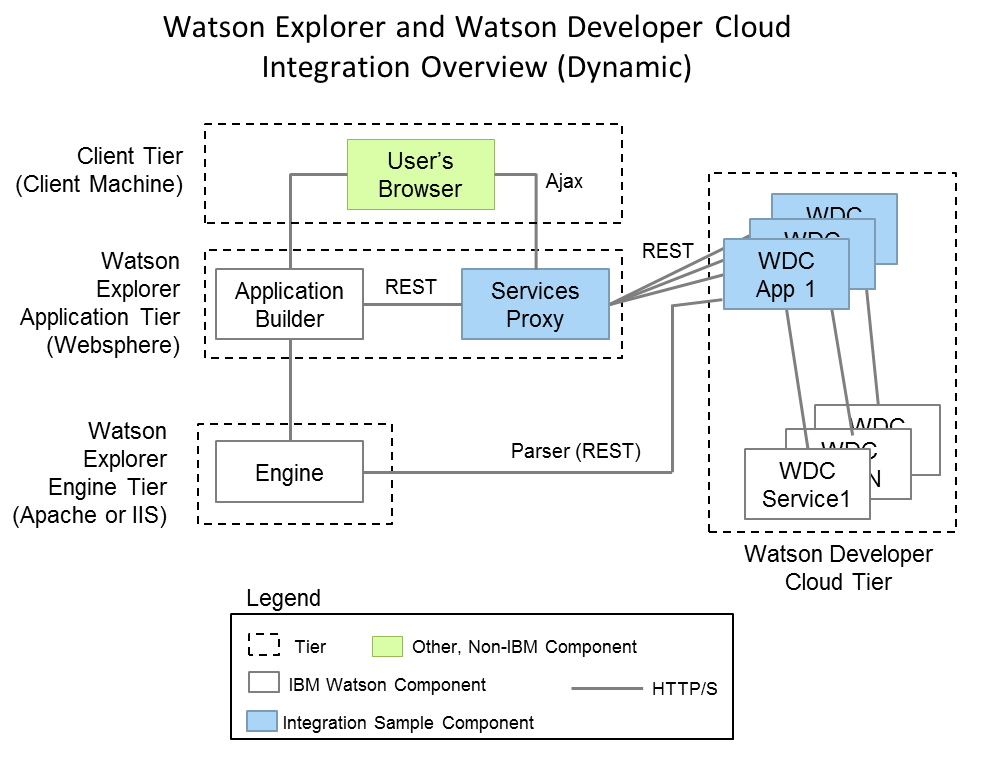

# Introduction to Integrating Watson Developer Cloud with Watson Explorer 

Watson Explorer is a search, visualization, and analytics platform that brings disparate sources of information together in a single interface. Watson Explorer Application Builder allows developers to quickly construct 360 degree view and search applications. These applications can be enhanced using content from external sources, external visualization libraries (such as D3.js), and external APIs. Integrating with the Watson Developer Cloud provides opportunities for further enhancing Watson Explorer applications to include cognitive-based features. Watson Developer Cloud applications can be integrated with Watson Explorer Application Builder in a number of ways depending on the use cases and desired functionality. 

In this set of examples, we introduce the basics for integrating a Watson Explorer application with applications deployed to the Watson Developer Cloud emphasizing some of the Watson Cognitive services. The examples provided are basic technical proofs of concept; we give you the technical foundation you need to build truly awesome cognitive applications. In each example we walk you through the process of deploying an application to the Watson Developer Cloud. We show you how to integrate that  application with Watson Explorer. We then provide you with some food for thought &mdash; What should you think about when deploying this kind of integration into a production environment? What are some additional ideas for integration? 

By the end of each example you should understand what each service does, how it could benefit your organization, and how to integrate it with an Application Builder application. 

Before beginning the tutorials you should review the prerequisites provided below. For more information on the available Watson Developer Cloud cognitive services, please visit the [services catalog](http://www.ibm.com/smarterplanet/us/en/ibmwatson/developercloud/services-catalog.html).

# Tutorial Listing
1. [Message Resonance Integration](wex-mr/watson-message-resonance-readme.md)
2. [Machine Translation Integration](wex-mt/watson-machine-translation-readme.md)
3. [Question and Answer Integration](wex-qa/watson-qa-readme.md)
4. [Relationship Extractor Integration](wex-re/watson-re-readme.md)
5. [User Modeling Integration](wex-um/watson-user-modeling-readme.md)
6. [Concept Expansion Integration](wex-ce/watson-concept-expansion-readme.md)

# Architecture
The integration between Watson Developer Cloud (WDC) and Watson Explorer follows relatively straightforward web services patterns. All of the WDC services use a basic REST API. This makes it realatively easy to use WDC services from WDC applications. The example WDC applications here also use a simple REST API to facilitate communiation between the WDC application and Watson Explorer.  Communication between a Watson Explorer application and a deployed WDC application is accomplished in two ways.

1. Watson Explorer Engine can communicate with WDC applications via a parser node (parser nodes in Engine allow for advanced and basic web requests to be made).
2. Watson Explorer Application Builder widgets communicate with WDC applications by going through a proxy deployed to the same web server as Application Builder.

The sample proxy enables two important properties.  First, browsers enforce a same-origin policy for web requests made from JavaScript, thus to allow for effective asynchronous user interactions from a client browser (via Ajax) a URL from the same domain must be available.  Rather than modify Application Builder core, the Proxy allows you to effectively create your own API for Ajax calls.  This same proxy can also be used directly by Application Builder widgets to improve maintainability.  In this capacity, the proxy creates an abstraction on top of WDC applications to buffer Application Builder widgets from WDC endpoint changes and better promote testing.

There are five basic integration patterns for combining Watson Explorer and Watson Developer Cloud.  The specific integration pattern used will depend on the use cases and desired functionality.

1. **Appliation Builder Widget**. The most common place to use a cognitive service is from within an Application Builder widget.  Most examples here demonstrate this.
2. **In the client browser**.  Once a page is rendered in a user's browser there may be use cases in which you would want to allow a user to interact with a WDC application without refreshing the page. For example, a user might dialog with Watson Q&A from an entity page.  At this time the included proxy must be used to satisfy the end-user's browser same-origin policy.
3. **At crawl time**.  The [Relationship Extractor Integration](wex-re/watson-re-readme.md) provides an example of an Engine converter that indexes the data returned from the Relationship Extractor service.
4. **At query time**.  It is also possible to access WDC applications at query time from Engine.
5. **Pre- or post-process**. In some cases it is useful to use a WDC application as a pre- or post-processing step and the output of this is used by Watson Explorer application in some way.

The integrations were developed using two runtimes on Bluemix; Java Web Services running on Websphere Liberty Profile and Ruby Sinatra. The following sections detail the setup for each of these approaches. 

# Setup for IBM Bluemix Development
Bluemix provides multiple different runtimes for your cloud-based application. In order to gain access to the Bluemix environment you will need to register for an account. After registration and configuration of the Cloud Foundry tools, you can setup your Java or Ruby development environment by following the instructions provided below. 

Steps for Bluemix setup:

1. Register for an account on [Bluemix](http://ace.ng.bluemix.net)
2. Install the [Cloud Foundry command line tool](https://www.ng.bluemix.net/docs/#starters/BuildingWeb.html#install_cf)

## Java Web-Based Applications
Some examples like the **Question and Answer Service** and the **Machine Translation Service** are a Java-based Bluemix application. The following steps get you setup and running for development of these applications. 

### Required development tools
- A JDK is required to compile the Java code. Download and install [IBM JDK 1.7](http://www.ibm.com/developerworks/java/jdk/eclipse/index.html)  
- We use Ant to build the package. Download and install [Apache Ant 1.9.4](http://ant.apache.org)

### Optional development tools
The following tools and plug-ins can make testing and deployments easier. 
- [Eclipse Luna Java EE Edition](http://www.eclipse.org)
- [IBM Eclipse tools for Bluemix](http://marketplace.eclipse.org/content/ibm-eclipse-tools-bluemix)
- [IBM WebSphere Application Server Liberty Profile developer tools for Luna](http://marketplace.eclipse.org/content/ibm-websphere-application-server-liberty-profile-developer-tools-luna)

### Required Libraries
The packages include the jars that are required in the dep-jar folder. These jars are derived from the following development libraries. 
- [Apache Wink 1.4.0](http://incubator.apache.org/wink)
- [Apache HTTP Core 4.3 ](http://hc.apache.org/)
- [Java API for Restful services (Jax-RS 2.0)](https://jax-rs-spec.java.net/)

## Ruby Sinatra Web-Based Applications
Some examples like the **User Modeling Service** and the **Concept Expansion Service** are a Ruby Sinatra-based Bluemix application. The following steps get you setup and running for development of these applications. 

### Required development tools
- Ruby is required to compile the code. Download and install [Ruby 1.9.3](http://rubyinstaller.org/downloads/)
- Ruby Devkit is useful for development. Download and install [Ruby DevKit 4.5.2](http://rubyinstaller.org/downloads/)
- JRuby is used in the Proxy development. Download and install [JRuby 1.7.13](http://www.jruby.org/download)

### Required libraries
- Bundler is required to build the bundle install. Download and install using "gem install bundler" after setting up JRuby.

## Watson Explorer

In Watson Explorer, you should:
- Build an Example Metadata collection in Watson Content Explorer, see the [Using Metadata for Searching, Sorting, and Filtering tutorial](http://www-01.ibm.com/support/knowledgecenter/SS8NLW_9.0.0/com.ibm.swg.im.infosphere.dataexpl.engine.tut.md.doc/c_vse-metadata-tutorial.html?lang=en) for instructions. 
- Learn how to create Application Builder search widgets, see the [Creating An Application tutorial](http://www-01.ibm.com/support/knowledgecenter/SS8NLW_9.0.0/com.ibm.swg.im.infosphere.dataexpl.appbuilder.doc/c_de-ab-devapp-tutorial.html?lang=en) for more information.

# Licensing
All sample code contained within this project repository or any subdirectories is licensed according to the terms of the MIT license, which can be viewed in the file license.txt.
