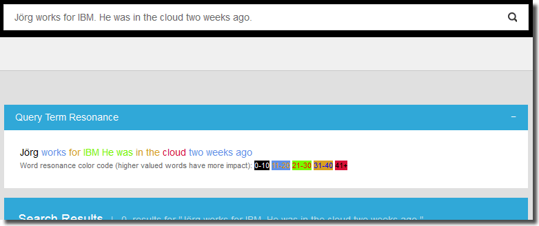

# Using Watson Message Resonance Service with Watson Explorer

The [Watson Message Resonance Service](http://www.ibm.com/smarterplanet/us/en/ibmwatson/developercloud/message-resonance.html) analyzes the popularity of a given word within the context of a specific community (as embodied by a corpus of text).

In the context of Watson Explorer, message resonance might prove very useful when combined with a 360 degree view of a customer or other (human) entities. Watson Explorer Application Builder already allows you to view relevant information from disparate data sources from a single web page. Considering the word impact scores generated by Watson Message Resonance allows your users to fine-tune their word choices for the greatest effect.

The goal of this example is to demonstrate how to get started with an integration between Watson Explorer and the Watson Message Resonance Service available on IBM Bluemix. By the end of the example you will have added a widget to Watson Explorer Application Builder that sends the search query to the Watson Message Resonance Service and displays the impact of each word within the cloud computing community.


## Prerequisites
Please see the [Introduction](/README.md) for an overview of the integration architecture, and the tools and libraries that need to be installed to create Java-based applications in Bluemix.

- An [IBM Bluemix](https://ace.ng.bluemix.net/) account
- [Watson Explorer](http://www-01.ibm.com/support/knowledgecenter/SS8NLW_9.0.0/com.ibm.swg.im.infosphere.dataexpl.install.doc/c_install_wrapper.html) - Installed, configured, and running

## What's Included in this Tutorial

This tutorial will walk through the creation and deployment of two components.

1. A basic Bluemix application exposing the Watson Message Resonance Service as a web service.
2. A custom Application Builder widget that sends the query from an Application Builder search to the Bluemix application created in the previous step, which then relays the query text to the Watson Message Resonance Service.  The Watson Message Resonance Service processes the text and returns its analysis to the Bluemix application, which relays the analysis back to our Application Builder widget.  The widget then displays the analysis for each query term.
<maybe 2 could use an illustration>


## Step-by-Step Tutorial

This section outlines the steps required to create a basic Watson Message Resonance query term impact widget in Application Builder.

The Watson Message Resonance service expects a word and returns a score representing the impact of that word.  This tutorial demonstrates finding the impact of many words simultaneously.  For this reason, the demo application accepts as input one block of text that it tokenizes into words (by splitting on non-alphanumeric characters), then submits the words individually for analysis by the service, and finally returns the words and their scores in a JSON array.

   
### Configuring and Deploying a Watson Message Resonance Bluemix Application

The demo Bluemix application uses a `manifest.yml` file to specify the application name, services bindings, and basic application settings.  Using a manifest simplifies distribution and deployment of Cloud Foundry applications.

If you have not done so already, sign in to Bluemix.

```
$> cf api api.ng.bluemix.net
cf login
```


Once you are signed in, you will need to create the Watson Message Resonance service that the demo application will bind to.  In this example, we're calling the service `wex-mr-service`. This name is already set in the `manifest.yml`.  Since services might be used by multiple applications, this name isn't ideal, but it's perfectly suitable for this example.

```
$> cf create-service message_resonance message_resonance_free_plan wex-mr-service
```


Build the application web service using Apache Ant. Before performing this step, verify that you are in the Bluemix directory. This will generate a packaged Java WAR called `wex-mr.war`.

```
$> ant
```

Note: the following Java libraries are required: `com.ibm.ws.javaee.jaxrs.1.1_1.0.1.jar`, `commons-codec-1.9.jar`, `httpclient-4.3.5.jar`, `httpcore-4.3.2.jar`, and `wink-json4j-1.4.jar`.


Next, deploy the application to your space in the Bluemix cloud.  If this is the first time deploying, the application will be created for you.  Subsequent pushes to Bluemix will overwrite the previous instances you have deployed.

```
$> cf push
```


Once the application has finished restarting, you should now be able to run a test using the simple application test runner included in the application.  You can see the route that was created for your application with `cf routes`.  The running application URL can be determined by combining the host and domain from the routes listing.  You can also find this information in the `manifest.yml` file. By default the route should be `wex-mr.mybluemix.net`.

#### Testing the Application

You can also test your Bluemix application and service by sending some text to the deployed servlet.  For example, try the following command:

```
$> curl --data-urlencode "message=Jörg works for IBM. He was in the cloud two weeks ago." "http://YOUR_ENDPOINT.mybluemix.net/resources/resonate"
```
```JSON
{"results":[{"word":"Jörg","score":"10","color":"black"},{"word":"works","score":"16","color":"cornflowerblue"},{"word":"for","score":"35","color":"goldenrod"},{"word":"IBM","score":"29","color":"lawngreen"},{"word":"He","score":"23","color":"lawngreen"},{"word":"was","score":"26","color":"lawngreen"},{"word":"in","score":"37","color":"goldenrod"},{"word":"the","score":"40","color":"goldenrod"},{"word":"cloud","score":"42","color":"crimson"},{"word":"two","score":"20","color":"cornflowerblue"},{"word":"weeks","score":"15","color":"cornflowerblue"},{"word":"ago","score":"16","color":"cornflowerblue"}]}
```


### Configuring the Watson Explorer Application Builder

Assuming you have completed the first [Application Builder tutorial](http://www-01.ibm.com/support/knowledgecenter/SS8NLW_9.0.0/com.ibm.swg.im.infosphere.dataexpl.appbuilder.doc/c_de-ab-devapp-tutorial.html), you will have a search page.  Let's add a message resonance widget that will analyze the user's query for impact. 

#### Building a Widget that Sends Text to the Watson Message Resonance Service

The purpose of this widget is to send the query text to the Watson Message Resonance service for analysis. The results of that analysis are then displayed in the Application Builder UI.

Once you have logged into the Application Builder administrative interface, follow these steps to create the custom widget and add it to the search results page.

1. Navigate to the Pages & Widgets -> Searches page.
2. Create a Custom new widget.
3. Set the ID of the widget to be `Watson_MR`
4. Set the Display name of the widget to be `Query Term Resonance`
5. Copy and paste the [code for this widget](ApplicationBuilder/MessageResonance.erb) into the Type-specific Configuration.
6. Click to turn "Asynchronously load content" on.
7. Save the widget.
8. Go back to the Searches page
9. Drag the `Watson_MR` widget to the top of the center column of the Searches page and save the page configuration.

At this point the widget should be fully configured.  To test the widget, navigate to the application and enter a search string.  Above the search results area, you should see your widget containing a copy of the query color-coded to represent resonance.  Hover over each word in the widget to see the exact resonance score.

This simple example illustrates a basic integration.



__*The completed Message Resonance query term widget*__

[The widget](ApplicationBuilder/MessageResonance.erb) is fully commented if you are curious about how the code works or are interested in extending the example functionality in a new widget.


### Production and Deployment Considerations

These examples are intended for demonstrative purposes only.  While you might be able to reuse the patterns and even parts of the code from these examples, there are several concerns that should be considered when developing a production-grade application.

- _Maintainability_ - For the example, only the Watson Message Resonance Service is built into the Bluemix application. If this were a real application you should consider creating a single Bluemix application for all cloud based cognitive (or other) services used within Bluemix.
- _Security_ - The example Bluemix applications are completely open and have no security.
- _Scalability_ - The example uses only a single cloud instance with the default Bluemix application settings.  In a production scenario consider how much hardware will be required and adjust the Bluemix application settings accordingly.
- _User Experience_ - The example widgets are only meant to demonstrate basic interaction. For a custom application using Application Builder you should carefully consider widget placement, overall look and feel, user needs, and how Watson Message Resonance can provide value to end users.
- _Wider Application_ - By itself, message resonance is interesting, but there are opportunities for generating more value with further effort. Consider how on-demand real time evaluation of text as it is typed might be used in your organization to improve the impact of user input and communication in general.
- _Performance_ - Rather than generating complete analysis with every search, it is worth considering leveraging [the proxy](/proxy/) to analyse only the text that the end-user selects.  Or consider resonance analysis at index-time to enrich the index with an impact rating for document titles.


## Possible Use Cases for a Watson Message Resonance/Watson Explorer Integration
 Here are some ideas to help get you started thinking about how Watson Message Resonance might be fully integrated into a Watson Explorer application.

- Score passages or metadata based on target users' preferred vernacular (for example: by using a training corpus targeted at social data) to enable search relevancy tuning.
- Combine with a thesaurus indexed using Watson Explorer to identify high value permutations for a given phrase.  Such a service might be used within an Application Builder widget or in applications outside the context of Watson Explorer.
