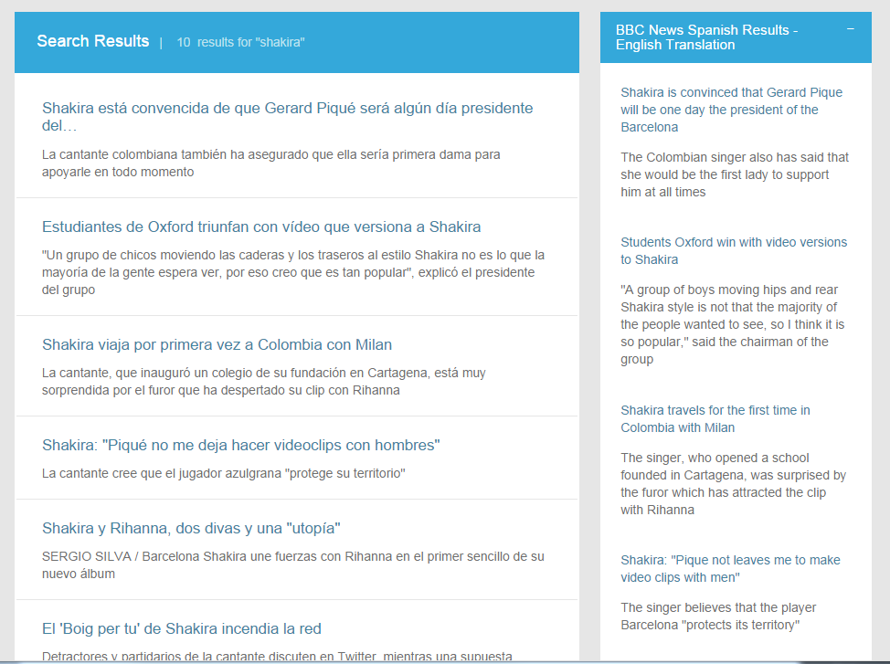

# Using Watson Machine Translation Service with Watson Explorer

The [Watson Machine Translation Service](http://www.ibm.com/smarterplanet/us/en/ibmwatson/developercloud/machine-translation.html) enables text to be translated from one language to another.  The October 2014 release includes 7 languages with more to be included in the coming months.  This sample code demonstrates the use of Spanish to English and English to Spanish.

In the context of Watson Explorer, machine translation might prove very useful when combined with a 360 degree view of a customer or other (human) entities. Watson Explorer Application Builder already allows you to view relevant information from disparate data sources from a single web page. Adding translation generated by Watson Machine Translation extends the reach of the data you already have.

The goal of this example is to demonstrate how to get started with an integration between Watson Explorer and the Watson Machine Translation Service available on IBM Bluemix. By the end of the example you will have added a widget to Watson Explorer Application Builder that sends a query to a federated search engine that returns results in Spanish and then leverages the Watson Machine Translation Service to translate those results into English.


## Prerequisites
Please see the [Introduction](/README.md) for an overview of the integration architecture, and the tools and libraries that need to be installed to create Java-based applications in Bluemix.

- An [IBM BlueMix](https://ace.ng.bluemix.net/) account
- [Watson Explorer](http://www-01.ibm.com/support/knowledgecenter/SS8NLW_9.0.0/com.ibm.swg.im.infosphere.dataexpl.install.doc/c_install_wrapper.html) - Installed, configured, and running
- [Application Builder proxy](/proxy/) - Installed and configured


## What's Included in this Tutorial

This tutorial will walk through the creation and deployment of two components.

1. A basic Bluemix application exposing the Watson Machine Translation Service as a web service.
2. A Spanish News federated source.
2. A custom Application Builder widget that sends the query from an Application Builder search to a Spanish News federated source, then translates the results to English via the Bluemix application created in the previous step.


## Step-by-Step Tutorial

This section outlines the steps required to create a Bluemix application and Watson Translation widgets in Application Builder.

The Watson Machine Translation service expects text and returns text that has been translated.  This tutorial demonstrates translation of many search results simultaneously, including title and snippet text for each result.  For this reason, the application accepts as input one block of text that can be split on a pre-determined delimiter, then submits the split text segments individually for translation, and returns the translated text in a JSON array.
   
### Configuring and Deploying the Bluemix Custom Watson Machine Translation Web Service

The example Bluemix application uses a `manifest.yml` file to specify the application name, services bindings, and basic application settings.  Using a manifest simplifies distribution and deployment of CloudFoundry applications.  To deploy the Watson translation example application you'll need to compile the web service application and deploy it to your Bluemix account.

If you have not done so already, sign in to Bluemix.

```
$> cf api api.ng.bluemix.net
cf login
```


Once you are signed in, you will need to create the Watson Machine Translation service that the example application will be binding to.  In this example, we are calling the service `wex-mt` (this name is already set in the `manifest.yml`).  Since services might be used by multiple applications, this name isn't ideal, but it's perfectly suitable for this example.

```
$> cf create-service "smt" free wex-mt
```

Build the application web service using Apache Ant. Before performing this step, verify that you are in the BlueMix directory. This will generate a packaged Java WAR called `wex-mt.war`.

```
$> ant
```
Note: the following Java libraries are required: com.ibm.ws.javaee.jaxrs.1.1_1.0.1.jar, commons-codec-1.9.jar and wink-json4j-1.4.jar.

Finally, deploy the application to your space in the Bluemix cloud.  If this is the first time deploying, the application will be created for you. Subsequent pushes to Bluemix will overwrite the previous instances you have deployed.

```
$> cf push
```


Once the application has finished restarting, you should now be able to run a test using the simple application test runner included in the application.  You can see the route that was created for your application with `cf routes`.  The running application URL can be determined by combining the host and domain from the routes listing.  You can also find this information in the `manifest.yml` file. By default the route should be `wex-mt.mybluemix.net`.


### Configuring the Watson Explorer Application Builder

The application integration uses text from a federated search in Watson Explorer engine to use for translation. A Custom widget takes the text from the federated results and submits it to the translation service. The output from the translation services is rendered in the widget. First we will create a federated search in Application Builder.  Then we will add the translation widget.


#### Creating a Federated Search Entity

For this example, the purpose of this entity is to generate English text.  We use a federated search entity to demonstrate translation of "live" text.  That is, Application Builder, and therefore the Watson Machine Translation service, has access to this text only at query-time.  The translation could not have been performed prior to entry of the end-user's query.

Watson Explorer Engine is distributed with a working BBC News federated source. 
For this example we created a federated source to return results from a Spanish news source, El Periodico.
Follow these steps to install this federated source. 

1. Login to Watson Explorer Engine Administration.
2. On the left hand navigation, click on the '+' next to XML. 
3. Enter 'source' for the Element and 'elperiodico-spanish-template' for the Name.
4. Edit the new xml node you just create. Click 'Edit'
5. Copy the source code for the [El Periodico news Spanish template](Engine/elperiodico-spanish-template.xml) into the edit space, overwriting everything in that space. 
6. Click 'OK' to save the source template. 
7. Next click on the '+' next to the Sources in the left hand navigation (we are going to create a new source based off of the new template).
8. Set the name to 'spanish-news', click on Template reference and select the El Periodico News in Spanish template. 
9. Click 'Add' to add the new source.
10. Save the new source by clicking "OK"
11. Now you should be able to query against this source and get back Spanish news articles. Try 'Shakira' as a query term. 

Now we need to define an entity in Application Builder that uses the new federated search source we just created. Once you have logged into the Application Builder administrative interface, follow these steps to create the federated search entity that connects to the Spanish News source in Engine.

1. In Application Builder, navigate to the Entities tab and click "Create new entity".
2. Name the entity Spanish News Article.
3. Select the Federated type and then choose spanish-news from the drop-down.
4. Save the entity.
5. Edit the entity you just created.
6. Scroll down to the "Search options" section of the entity configuration and enable "Searchable".
7. Scroll to the bottom of the entity configuration and save the entity.
8. Click "view in app" in the upper right and submit a search.  You should see News results in Spanish.


#### Building a Widget that Sends Text to the Watson Machine Translation Service

The purpose of this widget is to send all Spanish News result text to the Watson Machine Translation service for translation. The results of that translation are then displayed in the Application Builder UI.

Once you have logged into the Application Builder administrative interface, follow these steps to create the custom widget and add it to the search results page.

1. Navigate to the Pages & Widgets -> searches page.
2. Create a Custom new widget.
3. Set the ID of the widget to be `Watson_MT`
4. Set the Display name of the widget to be `Spanish News Results - English Translation`
5. Copy and paste the [code for this widget](ApplicationBuilder/Machine Translation.erb) into the Type-specific Configuration
6. Click to turn "Asynchronously load content" on.
7. Save the widget.
8. Go back to the Searches page
9. Drag the `Watson_MT` widget to the top of the right column of the Searches page and save the page configuration.

At this point the widget should be fully configured.  To test the widget, navigate to the application and enter a search term.  You should see two versions of the Spanish News search results - Spanish in the center column and English in the right column.

This simple example illustrates a basic integration.



__*The completed Watson Machine Translation Widget*__

[The widget](ApplicationBuilder/Machine Translation.erb) is fully commented if you are curious about how the code works or are interested in extending the example functionality in a new widget.


### Production and Deployment Considerations

These examples are intended for demonstrative purposes only.  While you might be able to reuse the patterns and even parts of the code from these examples, there are several concerns that should be considered when developing a production-grade application.

- _Maintainability_ - For the example, only the Watson Machine Translation Service is built into the Bluemix application. If this were a real application you should consider creating a single Bluemix application for all cloud based cognitive (or other) services used within Bluemix.
- _Security_ - The example Bluemix applications are completely open and have no security.
- _Scalability_ - The example uses only a single cloud instance with the default Bluemix application settings.  In a production scenario consider how much hardware will be required and adjust the Bluemix application settings accordingly.
- _User Experience_ - The example widgets are only meant to demonstrate basic interaction. For a custom application using Application Builder you should carefully consider widget placement, overall look and feel, user needs, and how Watson Machine Translation can provide value to end users.
- _Wider Application_ - By itself, simple text translation is interesting, but there are opportunities for generating more value with further effort. Consider how on-demand real time translation might be used in your organization to eliminate language barriers.
- _Performance_ - Rather than generating complete translations with every search, it is worth considering leveraging [the proxy](/proxy/) to translate only the text that the end-user selects.  Or consider translation at index-time to produce an index for each of many languages.


## Possible Use Cases for a Watson Machine Translation/Watson Explorer Integration
 Here are some ideas to help get you started about how Watson Machine translation might be fully integrated into a Watson Explorer application.

* Translate text from federated sources allowing users to search across federated sources in any language
* Index translated versions of documents so that users can search and view documents in their preferred of choice.
* Translate on demand Application Builder widgets, comments, or tags.
* Translate a user's query from another language into the language that the search content is in.
