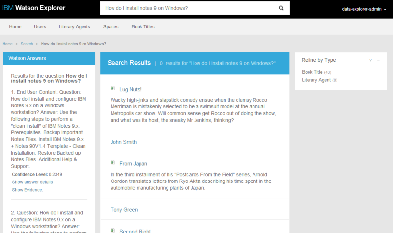
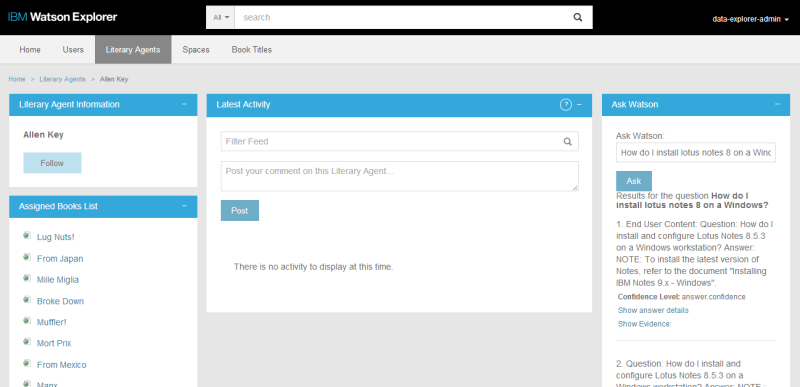

# Using Watson Q&A Service with Watson Explorer

The [Watson Question and Answer Service](http://www.ibm.com/smarterplanet/us/en/ibmwatson/developercloud/question-answer.html) provides answers in response to natural language questions. In addition to answers, the Watson Q&A Service provides confidence scores relative to the question, as well as evidence supporting how the Watson Q&A Service arrived at the given answers. Answers and evidence are determined based on a corpus of training data used to "teach" the Watson Q&A Service about a specific subject. (In this example, a corpus of IBM IT related information but other training sets including healthcare and travel are available with more to come.)

Since one of the primary goals of [Watson Explorer](http://www.ibm.com/smarterplanet/us/en/ibmwatson/explorer.html) is information discovery &mdash; search at its core is about finding answers from information &mdash; it is extremely natural to combine Watson Explorer and Watson Q&A to provide even more value to users.

The goal of this tutorial is to demonstrate how to get started with an integration between Watson Explorer and the Watson Q&A service available on IBM Bluemix.  By the end of the tutorial you will have added two widgets to Watson Explorer Application Builder.  One widget enables users to submit queries against both the Watson Explorer Engine and Watson Q&A Service.  A second widget demonstrates how users can continue interacting with Watson Q&A from an Application Builder entity page.



__*Q&A widget #1 "Watson Answers" widget enables users to submit queries against both the Watson Explorer and the Watson Q&A Service*__




__*Q&A Widget #2 "Ask Watson" widget demonstrates how users can continue interacting with Watson Q&A from an Application Builder entity page without performing a new search*__


In the initial October 2014 release, Watson Q&A Service has been trained against data in a limited number of domains. Even if the specific domains supported in the October 2014 release may not directly apply to your specific use case, the technical integration between Watson Explorer and the Watson Q&A would be the same regardless of the training corpus used.


## Prerequisites
Please see the [Introduction](/README.md) for an overview of the integration architecture, and the tools and libraries that need to be installed to create Java-based applications in Bluemix.

- An [IBM Bluemix](https://ace.ng.bluemix.net/) account
- [Watson Explorer](http://www-01.ibm.com/support/knowledgecenter/SS8NLW_10.0.0/com.ibm.swg.im.infosphere.dataexpl.install.doc/c_install_wrapper.html) - Installed, configured, and running
- [Application Builder proxy](/proxy/) - Installed and configured


## What's Included in this Tutorial

This tutorial will walk through the creation and deployment of three components.

1. A basic Bluemix application exposing the Watson Q&A Service as a web service.
2. A custom Application Builder widget that sends user's custom queries to your Bluemix Watson Q&A web service.
3. A custom Application Builder widget that allows users to interact with your Bluemix Watson Q&A web service without submitting a query.


## Step-by-Step Tutorial

This section outlines the steps required to create a Bluemix application and Watson Q&A widgets in Application Builder.

   
### Configuring and Deploying the Bluemix Custom Watson Q&A Web Service

The example Bluemix application uses a `manifest.yml` file to specify the application name, services bindings, and basic application settings.  Using a manifest simplifies distribution and deployment of CloudFoundry applications.  To deploy the Watson Q&A example application you'll need to compile the web service application and deploy it to your Bluemix account.

If you have not done so already, sign in to Bluemix.

```
$> cf api api.ng.bluemix.net
cf login
```


Once you are signed in, you will need to create the Watson Q&A service that the example application will be binding to.  In this example, we are calling the service `wex-qaapi` (this name is already set in the `manifest.yml`).  Since services might be used by multiple applications, this name isn't ideal, but it's perfectly suitable for this example.

```
$> cf create-service question_and_answer question_and_answer_free_plan wex-qaapi
```


Build the application web service using [Apache Maven](http://maven.apache.org/). Before performing this step, verify that you are in the Bluemix directory. This will generate a packaged Java WAR called `wex-wdc-qa-sample.war`.

```
$> mvn install
```

Finally, deploy the application to your space in the Bluemix cloud.  If this is the first time deploying, the application will be created for you. Subsequent pushes to Bluemix will overwrite the previous instances you have deployed.

```
$> cf push
```


Once the application has finished restarting, you should now be able to run a test using the sample application test runner included in the WAR.  You can view the route that was created for your application using `cf routes`.  The running application URL can be determined by combining the host and domain from the routes listing.  You can also find this information in the `manifest.yml` file. By default the route should be `wex-qa.mybluemix.net`.


### Configuring the Watson Explorer Engine
This example can be run on its own and does not depend on any Engine configuration. It is useful to see Watson Q&A results side-by-side with other search results.  If you do not already have an existing collection in Engine and wish to create one, crawl the `example-metadata` collection or see the [pre-requisites for searching with Engine](../README.md). 


### Configuring the Watson Explorer Application Builder

This example includes two widgets.  Both custom widgets require the use of the [Application Builder Proxy](/proxy/).

First, [update the Application Builder Proxy configuration](/proxy/config.ru) to point to your deployed Bluemix application.  Reset the Application Builder server.


```ruby
set :qa_endpoint, "http://MY_APPLICATION_ENDPOINT.mybluemix.net/resources/question/"
```


#### Building Q&A widget #1 "Watson Answers": Send Users' Queries to Engine and Watson Q&A

The purpose of this widget is to display answers to a user's search query (possibly a natural language question) side-by-side with search results coming from Engine.

Once you have logged into the Application Builder Administration tool, follow these steps to create the custom widget and add it to the search results page.


1. In the Application Builder Administration Tool, navigate to the Pages & Widgets -> Search page.
2. Create a Custom new widget.
3. Set the ID of the widget to be `Watson_QA`
4. Set the title of the widget to be `Watson Answers`
5. Copy and paste the [code for this widget](ApplicationBuilder/qaapi-widget.erb) into the Type Specific Configuration
6. Click to turn "Asynchronously load content" on.
7. Save the widget.
8. Go back to the Searches page
9. Add the `Watson_QA` widget to the Searches page and save the page configuration.

At this point the widget should be fully configured.  To test the widget, navigate to the application and perform a search.  Try a search for `How do I install notes 9 on Windows?`. The top answers from Watson with evidence will be visible alongside any search results that are returned by Engine.


__*The "Watson Answers" widget with search results from Engine*__


[The widget](ApplicationBuilder/qaapi-widget.erb) is fully commented if you are curious about how the code works or are interested in extending the example functionality in a new widget.


#### Building Q&A Widget #2 "Ask Watson": Let Users Interact with Watson Q&A without Reloading the Page

The purpose of this widget is to let users interact with Watson Q&A without having to perform a new search.  This is done through a simple text box and button that are separate from the main search page.

Once you have logged into the Application Builder Administration tool, follow these steps to create the custom widget and add it to the search results page.

1. In the Application Builder Administration Tool, Navigate to the Pages & Widgets -> Home page.
2. Create a Custom new widget.
3. Set the ID of the widget to be `Ask Watson`
4. Leave the title blank.
5. Copy and paste the [code for this widget](ApplicationBuilder/qaapi-widget-ajax.erb) into the Type Specific Configuration
6. Save the widget.
7. Go back to the Home page
8. Add the `Ask Watson` widget to the Home page and save the page configuration.

At this point the widget should be fully configured.  To test the widget, navigate to the Application Builder Home page.  Your widget should be visible.  Try asking Watson `How do I install notes 9 on Windows?`.  The top answers with evidence will be returned in the same widget without reloading the page.


__*The "Ask Watson" ajax enabled widget*__


[The widget](ApplicationBuilder/qaapi-widget-ajax.erb) is fully commented if you are curious about how the code works or are interested in extending the example functionality in a new widget.


### Production and Deployment Considerations

These examples are intended for demonstrative purposes only.  While you might be able to reuse the patterns and even parts of the code from these examples, there are several issues that should be considered when developing a production-grade application.

- _Maintainability_ - For the example, only the Watson Q&A Service is built into the Bluemix application. If this were a real application you should consider creating a single Bluemix application for all cloud based cognitive (or other) services used within Bluemix.
- _Security_ - The example Bluemix applications are completely open and have no security.
- _Scalability_ - This example uses only a single cloud instance with the default Bluemix application settings.  In a production scenario consider how much hardware will be required and adjust the Bluemix application settings accordingly.
- _User Experience_ - The example widgets are only meant to demonstrate basic interactions. For a custom application using Application Builder you should carefully consider widget placement, overall look and feel, user needs, and how Watson Q&A can provide value to end users.
- _Training Data and Data Modeling_ - When new data sources or methods of training become available, developers will be faced with design questions around how to train data such that users get maximum value when using results side-by-side with full text search. Specific strategies for training, indexing, and using the information in combination will be highly dependent on the data and specific use cases for the application.


## Possible Use Cases for a Watson Q&A/Watson Explorer Integration

Watson Q&A and full text search is a natural combination. Providing users with results from both full text search and natural language processing from question and answer greatly improves users' ability to find specific information they need &mdash; not just search results.  Here are some ideas to help get you started about how Watson Q&A might be fully integrated into a Watson Explorer application.

* Provide suggested answers to user's queries side-by-side with full text search results as shown in this example.
* Add a Q&A widget to specific entity pages to allow users to interact with Watson in the context of a specific entity.
* Offer answers from Watson as spotlights on the search results page.
* Create a federated source for Watson Q&A and interleave answers from Watson with full text search results.
* Use Watson Q&A as a dedicated search from a unique Application Builder tab.
* Provide top answers from Watson in the context of the entity a user is currently viewings, perhaps based on association information or other relevant metadata for that entity.
