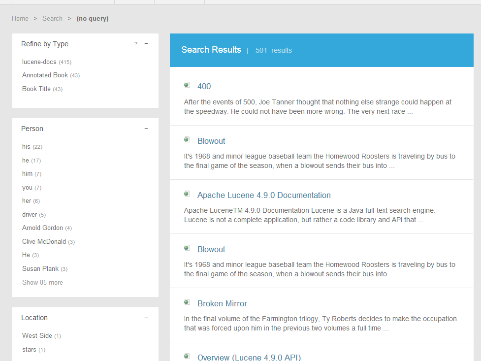
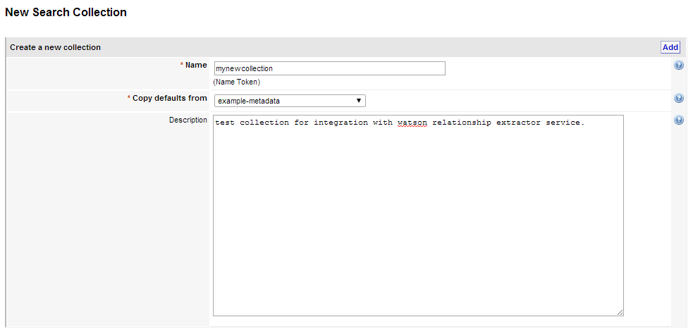
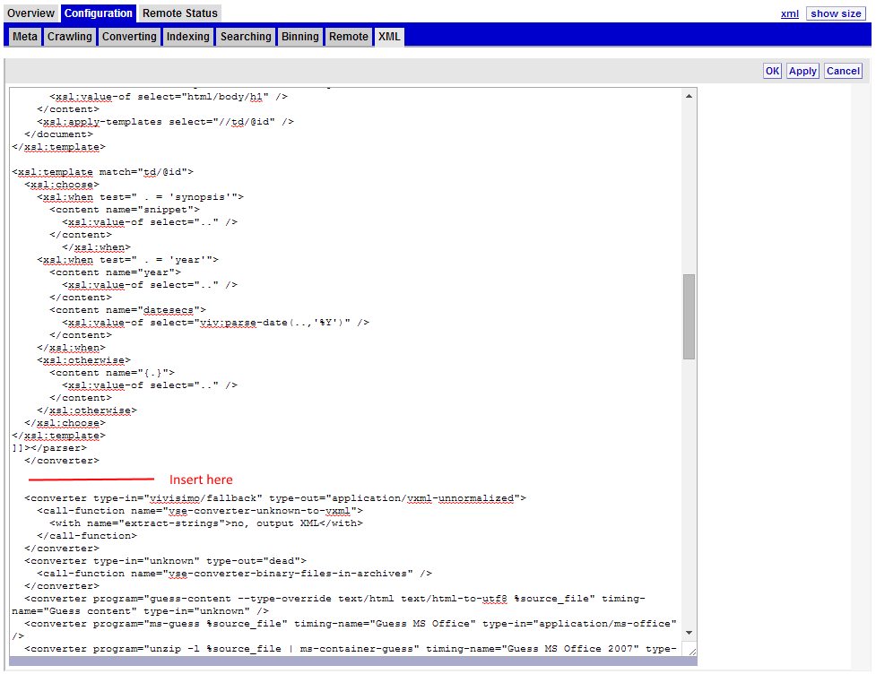
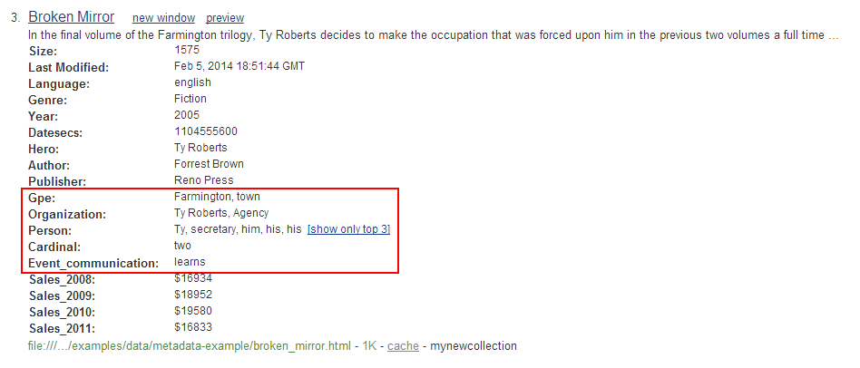
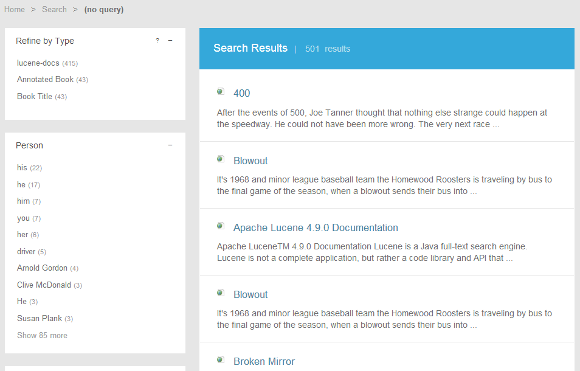

# Using Watson Relationship Extraction Service with Watson Explorer

The [Watson Relationship Extraction Service](http://www.ibm.com/smarterplanet/us/en/ibmwatson/developercloud/relationship-extraction.html) analyzes text to find entities &mdash; including names, events, and dates &mdash; as well as the relationships among them. The extraction of entities such as names and dates is called entity extraction and is frequently used in search-based applications for categorizing data and creating hierarchies that can be used for navigation through a result set.  [Watson Explorer](http://www.ibm.com/smarterplanet/us/en/ibmwatson/explorer.html) can use extracted entities to aid in information discovery by improving navigation through uncategorized content.

The goal of this tutorial is to demonstrate how to get started with an integration between Watson Explorer and the Watson Relationship Extraction service available on IBM Bluemix. By the end of the tutorial you will have added a refinement widget to Watson Explorer Application Builder that uses information extracted using an annotator (entity extractor) added to the conversion pipeline of Watson Explorer Engine.



__*The "Navigation" widget displaying extracted entities*__


For the initial release, Watson Relationship Extraction offers two APIs: Annotator for English and Annotator for Spanish news models.


## Prerequisites
Please see the [Introduction](/README.md) for an overview of the integration architecture, and the tools and libraries that need to be installed to create Java-based applications in Bluemix.

- An [IBM Bluemix](https://ace.ng.bluemix.net/) account
- [Watson Explorer](http://www-01.ibm.com/support/knowledgecenter/SS8NLW_9.0.0/com.ibm.swg.im.infosphere.dataexpl.install.doc/c_install_wrapper.html) - Installed, configured, and running


## What's Included in this Tutorial

This tutorial will walk through the creation and deployment of three components.

1. A basic Bluemix application exposing the Watson Relationship Extraction service as a web service.
2. A Watson Explorer Engine custom converter. This converter sends text to the Bluemix application and uses the response to enrich searchable metadata for indexed documents.
3. An Application Builder widget that uses the extracted, indexed metadata to provide filtering through search result refinement.


## Step-by-Step Tutorial

This section outlines the steps required to create a basic Watson Relationship Extraction widget in Application Builder, the custom converter in Engine, and the Bluemix service used by the custom converter.

   
### Configuring and Deploying the Bluemix Custom Watson Relationship Extraction Web Service

The example Bluemix application uses a `manifest.yml` file to specify the application name, services bindings, and basic application settings.  Using a manifest simplifies distribution and deployment of CloudFoundry applications.  To deploy the Watson Relationship Extraction example application you'll need to compile the web service application and deploy it to your Bluemix account.

If you have not done so already, sign in to Bluemix.

```
$> cf api api.ng.bluemix.net
cf login
```


Once you are signed in, you will need to create the Watson Relationship Extraction service that the example application will be binding to.  In this example, we're calling the service `wex-re` (this name is already set in the `manifest.yml`).  Since services might be used by multiple applications, this name isn't ideal, but it's perfectly suitable for this example.

```
$> cf create-service relationship_extraction relationship_extraction_free_plan wex-re
```


Build the application web service using [Apache Maven](http://maven.apache.org/). Before performing this step, verify that you are in the Bluemix directory. This will generate a packaged Java WAR called `wex-wdc-relationship-extraction-sample.war`.

```
$> mvn target
```


Finally, deploy the application to your space in the Bluemix cloud.  If this is the first time deploying, the application will be created for you.  Subsequent pushes to Bluemix will overwrite the previous instances you have deployed.

```
$> cf push
```


Once the application has finished restarting, you should now be able to run a test using the simple application test runner included in the WAR.  You can view the route that was created for your application with `cf routes`.  The running application URL can be determined by combining the host and domain from the routes listing.  You can also find this information in the `manifest.yml` file. By default the route should be `wex-re.mybluemix.net`.


### Configuring the Watson Explorer Engine

To configure Engine for this example you will need to do the following:

1. Create a new collection based on example-metadata.
2. Add the custom converter and modify a variable in the XSLT to use your Bluemix application.
3. Initiate a crawl.
4. Verify that Engine is configured properly.


A common use for the type of processing done by the Watson Relationship Extraction Service is index enrichment.  That is, we can apply Relationship Extraction to ingested data and store the resulting analysis in the index as metadata that can be used at search time or in the display.

One way to accomplish this task is to use the Watson Relationship Extraction Service at crawl time from a Watson Explorer converter. The [example converter provided in this example](engine/wex-re-converter.xml) was developed to be used as a part of the out-of-the-box example-metadata search collection.  For each document, the example converter sends the snippet text to the Watson Relationship Extraction Service and then stores the results from the Relationship Extraction service in a new content nodes with names based on the entity type determined by the service.

To use the example converter, go to the Watson Explorer Engine administrator tool interface and create a new collection based on example-metadata.  Name it 'example-metadata-watson'.




__*Creating a new search collection*__


Go to the XML of the collection, click "edit" and paste the example converter XML into the converters section, immediately after the “Create Metadata from Content” converter.



__*Inserting the converter into the collection XML*__


Before saving the xml, change the posting url (for example, http://wex-re.mybluemix.net/api/extract) to the route for your Bluemix application.


```xslt
<!-- When we have a snippet, we want to copy it too.
     But we also want to insert some addition contents that contain
     info from SIRE -->
<xsl:variable name="url" select="'http://wex-re.stage1.mybluemix.net/api/extract'" />
```


Click OK to save the XML.

Switch to the Overview tab in the collection and click Start to initiate a new crawl.

After the crawl has completed, perform a test search.  You should now see the new additional metadata that has been added to the document. 




__*The newly extracted contents*__

The custom converter we added extracts entities that were identified by the Watson Relationship Extraction service, and creates fast indexed content nodes in the document for each extracted entity. The values of each extracted entity will be visible in search and, since they are also fast indexed, can be used to create refinements and associations in Watson Explorer Application Builder.


### Configuring the Watson Explorer Application Builder

Since the integration between Watson Explorer Engine and the Watson Relationship Extraction service has already created fast-indexed entities in the search index, the process of displaying these navigation aids to the user is trivial.  The following steps show how to create refinement widgets based off of the extracted content. 


#### Building the Watson Extracted Entities Refinement Widget

The purpose of this widget(s) is to display extracted entities as navigation aides to a user's search query to improve the ability to find a search result.

Before you can search your collection in Application Builder you must first add the collection as an entity. Once you have logged into the Application Builder Administration tool, create a new entity that uses your new collection as its source of data following these steps.

1. From the Entities tab, click `Create new Entity`
2. Name the collection `Annotated Book` and set the Data store to `example-metadata-watson` (or whatever you named your collection)
3. Create the Entity. You should then be taken to the Entity options page.
4. Under `Search options` flip the switch to make the entity `Searchable`.
5. Save the changes by clicking `save entity` at the bottom of the page.


Please see the [Application Builder Tutorial on creating entities](http://pic.dhe.ibm.com/infocenter/dataexpl/v9r0/index.jsp?topic=%2Fcom.ibm.swg.im.infosphere.dataexplorer.product.doc%2Fcom.ibm.swg.im.infosphere.dataexpl.appbuilder.doc%2Fc_de-ab-devapp-tutorial.html) for more information on how to connect backends to Application Builder or configure entities in Application Builder.

To test that your entity is configured correctly, perform a search in Application Builder for `Lug Nuts!`.  You should now see at least one result in the search results list.  At this point, alternatively you can hide the entity list page for the `Annotated Book` entity if you know how to do this and desire to do so.

Next, follow these steps to create the refinement widget and add it to the search results page.

1. In the Application Builder Administration Tool, Navigate to the `Pages & Widgets` -> `Searches` -> `Details page`.
2. Create a new refinement widget
3. Set the ID of the widget to be `searches-refinement-person`
4. Set the title of the widget to be `Person`
5. Set the type-specific configuration to be "field('PERSON')"
6. You can leave the remainder of the settings at their default values. 
7. Save the widget.
8. Go back to the Searches page
9. Add the `searches-refinement-location` widget to the Searches page and save the page configuration.


At this point the widget should be fully configured.  To test the widget, navigate to the application and perform a search.  A null search will be most effective in this case to allow you to see the full listing of person entities extracted from the documents. 



__*Person refinement widget with search results from Engine*__

Our example pulled all entities and fast indexed them to prepare for creating the refinement widget. Ideally you would not need or want to do this, as you may find that not all extractions are useful to your users. In addition, the example widget only refines on one extracted entity, you could create multiple refinements with these values or use them for sorting capabilities as well.

Notice that words like "he," "him," "you," and "her" are added as refinements.  The Watson Relationship Extraction service does provide relationship information so that it is possible in many circumstances to know exactly who a specific pronoun such as "he" is referencing.  This example does not take the specific relationships into account when creating fast-indexed metadata content, but substituting pronouns and partial names for a canonical is a high value application of the information provided by the Watson Relationship Extraction web service.


### Production and Deployment Considerations

These examples are intended for demonstrative purposes only.  While you might be able to reuse the patterns and even parts of the code from these examples, there are several concerns that should be considered when developing a production-grade application.

- _Maintainability_ - For the example, only the Watson Relationship Extraction Service is built into the Bluemix application. If this were a real application you should consider creating a single Bluemix application for all cloud based cognitive (or other) services used within Bluemix.
- _Security_ - The example BlueMix applications are completely open and have no security.
- _Scalability_ - This example uses only a single cloud instance with the default Bluemix application settings.  In a production scenario consider how much hardware will be required and adjust the Bluemix application settings accordingly.
- _Reliability_ - Calling a web service can and will fail. When this happens in a converter, the document will not be indexed which is likely not a desired outcome.  The example does not attempt to retry in the event of failure, nor does the example allow for having a partially updated document (for example, only the ingested text without annotations in the event that the web service call to Bluemix fails).
- _User Experience_ - The example widgets are only meant to demonstrate basic interaction. For a custom application using Application Builder you should carefully consider widget placement, overall look and feel, user needs, and how Watson Relationship Extraction can provide value to end users.
- _Crawl Performance_ - Calling out to a web service from a converter can significantly increase the amount of time required for indexing content when ingesting extremely large data sets. If you are indexing extremely large datasets, there are other metadata enrichment strategies that might be used to promote specific desired quality attributes relevant to your specific needs.


## Possible Use Cases for a Watson Relationship Extraction and Watson Explorer Integration

Entity extraction can provide taxonomy useful for faceted navigation in search-based applications and deeper connectedness in "360 Degree View" applications.  The addition of relationship information side-by-side with entity extraction creates huge value-adding opportunities. Here are some ideas to help get you started for how Watson Relationship Extraction might be fully integrated into a Watson Explorer application.

* Use extracted entities to provide faceted navigation of persons, locations, and organizations as shown in this example. 
* Use mentions, entities, and the relations between them to construct a graphical representation of the relationships, allowing the user to navigate between common themes among documents. 
* Enhance passage search by substituting second-person references with primary references &mdash; for example, replace "he" with "Thomas J. Watson".
* Construct queries on the fly to enable "find similar" or "search for more like this" features.
* Combine with other systems to allow for comparative analysis with documents that might not otherwise be relatable.
* Substitute related extracted entities within a document with the equivalent terms _in position_ by using parallel indexing streams such that proximity search across related terms provides identical precision and recall.
