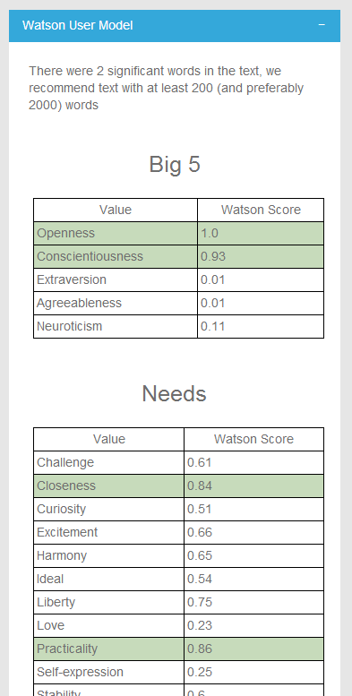
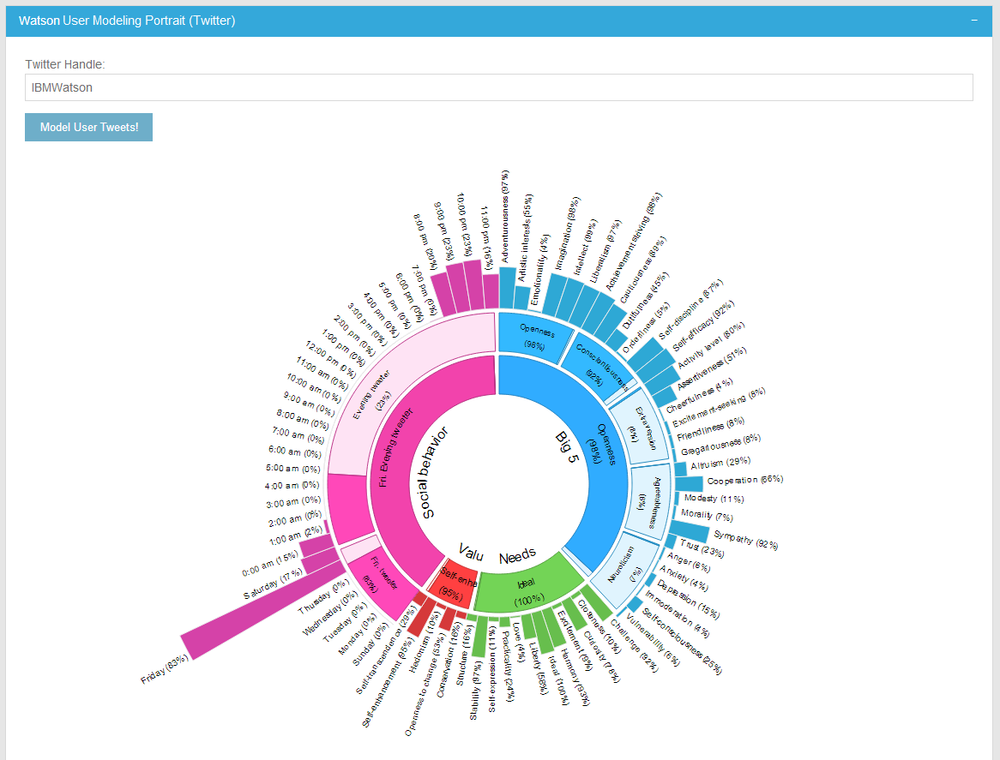

# Using Watson User Modeling Service with Watson Explorer

The [Watson User Modeling Service](http://www.ibm.com/smarterplanet/us/en/ibmwatson/developercloud/user-modeling.html) creates a [psychographic](http://en.wikipedia.org/wiki/Psychographic) profile of a person or group based on textual information. The current Watson User Modeling Service is trained using social media status updates such as from Twitter or Facebook, though other data sets that are personalized to a user might be used.  The generated profile might be used as is or combined with other data to generate insights into purchasing behaviors, issues, and other customer interactions.

In the context of Watson Explorer, a psychographic profile might prove very useful when combined with a 360 degree view of a customer or other (human) entities. Watson Explorer Application Builder already allows you to view relevant information from disparate data sources from a single web page. Adding a psychographic profile generated by Watson User Modeling layers _insights_ on top of the data you already have.

The goal of this example is to demonstrate how to get started with an integration between Watson Explorer and the Watson User Modeling service available on IBM Bluemix.  By the end of the example you will have added two widgets to a Watson Explorer Application Builder application.  One widget creates and displays a psychographic profile based on information indexed in Engine provided by an entity. A second widget demonstrates how users can generate a psychographic profile in real time based on a Twitter handle that is provided in the context of an entity page (simulating an in-progress user/customer interaction).


## Prerequisites
Please see the [Introduction](/README.md) for an overview of the integration architecture, and the tools and libraries that need to be installed to create Java-based applications in Bluemix.

- An [IBM Bluemix](https://ace.ng.bluemix.net/) account
- [Watson Explorer](http://www-01.ibm.com/support/knowledgecenter/SS8NLW_9.0.0/com.ibm.swg.im.infosphere.dataexpl.install.doc/c_install_wrapper.html) - Installed, configured, and running
- [Application Builder proxy](/proxy/) - Installed and configured
- A basic search application configured in Application Builder. For the purposes of this example, the [example-metadata based tutorial application](http://www-01.ibm.com/support/knowledgecenter/SS8NLW_9.0.0/com.ibm.swg.im.infosphere.dataexpl.appbuilder.doc/c_de-ab-devapp-tutorial.html) is sufficient.
- (Optional) [Prerequisites for creating a Bluemix Ruby based application](/README.md). This prerequisite is required if you would like to develop Ruby applications on your local machine.
- (Optional) A Twitter account with API access.  This will be used to fetch status updates given a user's Twitter handle in one of the example widgets.

## What's Included in this Tutorial

This tutorial will walk through the creation and deployment of three components.

1. A basic Bluemix application exposing the Watson User Modeling Service as a web service.
2. A custom Application Builder widget that sends text from an Application Builder entity to your Bluemix User Modeling web service.
3. A custom Application Builder widget that takes a Twitter handle as input and creates a psychographic profile based on a user's Twitter status updates in real time.


## Step-by-Step Tutorial

This section outlines the steps required to create a basic Watson User Modeling widget in Application Builder and connect it with a custom Bluemix web service.

   
### Configuring and Deploying the BlueMix Custom Watson User Modeling Web Service

The example Bluemix application uses a `manifest.yml` file to specify the application name, services bindings, and basic application settings.  Using a manifest simplifies distribution and deployment of CloudFoundry applications (for example, Bluemix).  Since the example application is written in Ruby, the code can be deployed to Bluemix as is. Ruby develpment tools are only required if you would like to develop and test the application locally.

If you have not already, sign in to Bluemix.

```
$> cf api api.ng.bluemix.net
cf login
```


Once you are signed in, you will need to create the Watson User Modeling service that the example application will bind to.  In this example, we're calling the service `wex-um`. This name is already set in the `manifest.yml`.  Since services might be used by multiple applications, this name isn't ideal (a more descriptive name can improve maintainability), but it's perfectly suitable for this example.

```
$> cf create-service "systemudemoapisl-prod" systemudemo_plan_free wex-um
```


Next, deploy the application to your space in the Bluemix cloud.  If this is the first time deploying, the application will be created for you.  Subsequent pushes to Bluemix will overwrite the previous instances you deployed.

```
$> cf push
```


Once the application has finished restarting, you should now be able to run a test using the simple application test runner included in the application.  You can see the route that was created for your application with `cf routes`.  The running application URL can be determined by combining the host and domain from the routes listing.  You can also find this information in the `manifest.yml` file. By default the route should be `wex-um.mybluemix.net`.  The route is also available from your application dashboard in Bluemix.


#### Configuring the BlueMix Application for Twitter API Access

The Twitter enabled widget requires a valid [Twitter API](https://dev.twitter.com/) token for use.  Follow these steps to create a Twitter API application and update the example Bluemix code to use your Twitter API credentials.

1. Sign in to [https://dev.twitter.com/](https://dev.twitter.com/) using your Twitter username and password.
2. Once you are logged in you can view "My applications" from the drop down menu under your profile picture in the upper right, or visit [https://apps.twitter.com/](https://apps.twitter.com/) directly.
3. Create a new App.
4. Fill out the form and agree to Twitter's Terms of Service.  A Callback URL is not required for this application.
5. The next page will show a summary of your Twitter API application.  Click on the "API Keys" tab.
6. The `API key` and `API secret` are what you'll need to connect your Watson Bluemix application to Twitter.  Change lines 17 and 18 of [application_controller.rb](BlueMix/controllers/application_controller.rb) to reflect your `API key` and `API secret`. It is not necessary to generate a Twitter access token for the integration. 


```ruby
set :twitter_api_key, "YOUR API KEY GOES HERE"
set :twitter_api_secret, "YOUR API SECRET GOES HERE"
```


At this point your Bluemix application should be able to use the Twitter API to directly download status updates with a valid Twitter handle.  Push your updated application up to Bluemix using `cf push` and test the newly deployed application.

Please note that the Twitter API has limits on the number of requests that can be made per hour.  The example code will fail gracefully when these limits and other common API errors occur, but the responsibility for managing your Twitter API and usage is up to you. For more information on the Twitter API see [https://dev.twitter.com/](https://dev.twitter.com/). The example Application Builder widget uses the excellent [Twitter Gem](http://sferik.github.io/twitter/).


### Configuring the Watson Explorer Engine

This example requires that example metadata is crawled and configured for use in Application Builder. If you have not already created a basic application using the example-metadata content, see the [pre-requisites for searching with Engine](/README.md). The Application Builder Tutorial can be found in the [Watson Content Explorer documentation.](http://www-01.ibm.com/support/knowledgecenter/SS8NLW_9.0.0/com.ibm.swg.im.infosphere.dataexpl.appbuilder.doc/c_de-ab-devapp-tutorial.html) 

### Configuring the Watson Explorer Application Builder

This example includes two widgets.  Both custom widgets require the use of the [Application Builder Proxy](/proxy/).

To use the proxy you must [update the Application Builder Proxy configuration](/proxy/config.ru) to point to your deployed Bluemix application.


```ruby
set :um_endpoint, "http://MY_APPLICATION_ENDPOINT.mybluemix.net/um/"
```

Once you have updated the Proxy, restart the Application Builder server for the changes to take effect.


#### Building User Modeling widget #1: Send Text to the User Modeling Service

The purpose of this widget is to send a single block of text to the User Modeling service for analysis. The results of that analysis are then displayed in the Application Builder UI.

Once you have logged into the Application Builder Administration tool, follow these steps to create the custom widget and add it to the search results page.

1. In the Application Builder Administration Tool, navigate to the Pages & Widgets -> Book Title page. (If you have different entities in your application, choose one that has a snippet or be prepared to modify the example widget code.)
2. Create a Custom new widget.
3. Set the ID of the widget to be `Watson_UM`
4. Set the title of the widget to be `Watson User Model`
5. Copy and paste the [code for this widget](ApplicationBuilder/user-modeling-text-widget.erb) into the Type Specific Configuration.
6. Click to turn "Asynchronously load content" on.
7. Save the widget.
8. Go back to the Book Title page
9. Add the `Watson_UM` widget to the Book Title page and save the page configuration.

At this point the widget should be fully configured.  To test the widget, navigate to the application and choose a Book Title entity. I picked "Lug Nuts!" in the image below.  The title from "Lug Nuts!" is used to create the model shown. 

This simple example illustrates a basic integration. You should choose text that is relevant to a user or entity that you are modeling and you must provide enough text to generate a reliable model.  See the [User Modeling documentation]() for more guidance on text selection and recommendations.



__*The "Sent Text" User Modeling widget*__

[The widget](ApplicationBuilder/user-modeling-text-widget.erb) is fully commented if you are curious about how the code works or are interested in extending the example functionality in a new widget.


#### Building User Modeling Widget #2: Twitter Status User Model Widget

The purpose of this widget is to let users add supplementary information to the 360 degree view of the current entity. For example, if you were looking at a customer page you could ask the customer for their Twitter handle, which will then allow you to create a user model that might be correlated with information available from other systems accessible from the entity page within Application Builder. For the purposes of the example, we're going to add the widget to the Home page.

Before starting the work in Application Builder, we first need to add some javascript and css styling to help with the rich visualization we are going to display. Follow these steps to add in these additional assets. 

$AB_HOME refers to the home folder for the specific Application Builder installation.  For example, on a default Windows installation, `$AB_HOME` might be C:\Program Files\IBM\IDE\AppBuilder

1. Copy the [D3 javascript](ApplicationBuilder/d3.js) into the folder $AB_HOME/wlp/usr/servers/AppBuilder/apps/AppBuilder/javascripts
2. Copy the [user modeling javascript](ApplicationBuilder/user-model-visualization.js) into the folder $AB_HOME/wlp/usr/servers/AppBuilder/apps/AppBuilder/javascripts
3. Copy the [user modeling css](ApplicationBuilder/user-model-visualization-style.css) into the folder $AB_HOME/wlp/usr/servers/AppBuilder/apps/AppBuilder/stylesheets

Now we can begin the process of configuring Application Builder. 

Once you have logged into the Application Builder Administration tool, follow these steps to create the custom widget and add it to the search results page.

1. In the Application Builder Administration Tool, navigate to the Pages & Widgets -> Home page.
2. Create a Custom new widget.
3. Set the ID of the widget to be `watson_twitter_um`
4. Set the title of the widget to be `Watson User Model - Twitter`
5. Copy and paste the [code for this widget](ApplicationBuilder/user-modeling-twitter-widget.erb) into the Type Specific Configuration.
6. Save the widget.
7. Go back to the Home page.
8. Change the layout to the two pane layout to allow for more room for the widget.
8. Add the `watson_twitter_um` widget to the largest column on the Home page and save the page configuration.

At this point the widget should be fully configured.  To test the widget, navigate to the Application Builder Home page.  Your widget should be visible.  Try entering your Twitter handle or using the IBM Watson Twitter stream, `IBMWatson`. Once you've submitted the form, your Bluemix service will fetch about 200 Twitter status updates for the provided handle. The resulting analysis from Watson will be displayed under the form in the widget.



__*The "Twitter Status" User Modeling widget*__

[The widget](ApplicationBuilder/user-modeling-twitter-widget.erb) is fully commented if you are curious about how the code works or are interested in extending the example functionality in a new widget.  One obvious extension is creating a widget that automatically fetches Tweets based on a handle stored in an entity field rather than waiting for a user to enter a Twitter user name in the browser after the fact.


### Production and Deployment Considerations

These examples are intended for demonstrative purposes only.  While you might be able to reuse the patterns and even parts of the code from these examples, there are several concerns that should be considered when developing a production-grade application.

- _Maintainability_ - For the example, only the Watson User Modeling Service is built into the Bluemix application. If this were a real application you should consider creating a single Bluemix application for all cloud based cognitive (or other) services used within Bluemix.
- _Security_ - The example Bluemix applications are completely open and have no security.
- _Scalability_ - This example uses only a single cloud instance with the default Bluemix application settings.  In a production scenario consider how much hardware will be required and adjust the Bluemix application settings accordingly.
- _Using Twitter_ - The Twitter API has limits in how many requests can be made to the API per hour.  Consider carefully whether your required load can be met by these limits and use the appropriate API authentication mechanism and caching strategies.
- _User Experience_ - The example widgets are only meant to demonstrate basic interaction. For a custom application using Application Builder you should carefully consider widget placement, overall look and feel, user needs, and how Watson User Modeling can provide value to end users.
- _Integration with other Analytics_ - By itself a user model is not that interesting, but there are opportunities for generating insights with further analysis. Consider how this information might be used in conjunction with other data available in your organization and what you might show an end user in Application Builder based on your insights. For example, psychographic profile might only be a means to an end and only a recommendation is shown in Application Builder.
- _Performance_ - Rather than generating profiles from the User Modeling service with every request, it may be worth considering caching the information (perhaps even in a Watson Content Explorer search collection) and updating only periodically instead of with every request.


## Possible Use Cases for a Watson User Modeling/Watson Explorer Integration

Watson User Modeling offers another dimension of the "360 Degree View" of a customer or other entity and starts to paint a picture of a person not just through their data but their personality and personal preferences.  Here are some ideas to help get you started for how Watson User Modeling might be fully integrated into a Watson Explorer application.

* Display a psychographic profile on an entity page alongside other information relevant to that entity. For Person entities, consider using that person's Twitter or Facebook status updates.  For "thing" entities such as products, consider collecting Twitter status updates based on a search for that product name or a #hashtag to generate a profile for people who discuss that product or service.
* Perform additional analysis using the generated psychographic profiles as one of the variables under consideration, for example looking for correlations and other insights across other data within your organization, such as customer tickets or sales histories.
* Display recommendations for action based on a psychographic profile generated by the User Modeling service.
* Tailor the Application Builder UI based on the user's psychographic profile.
* Incorporate the generated user model into other entity analytics available within Application Builder.
* Index profiles so they can be searched, filtered, sorted and displayed alongside other information available in your organization.
